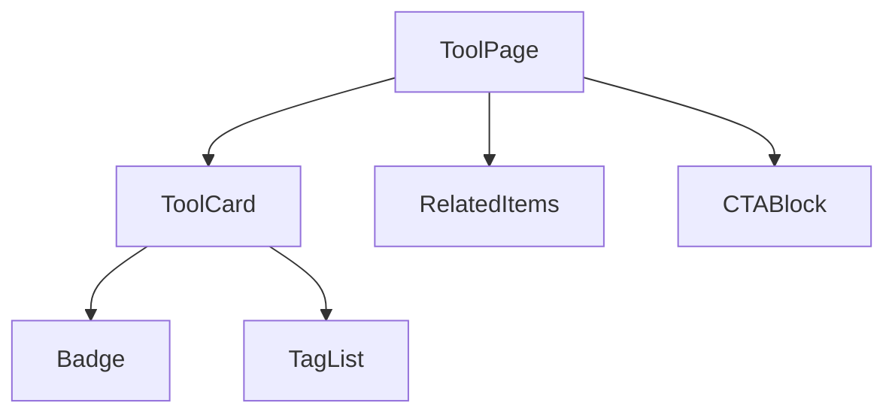
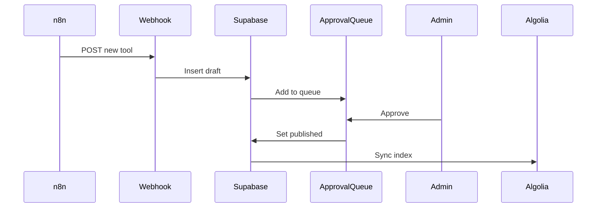
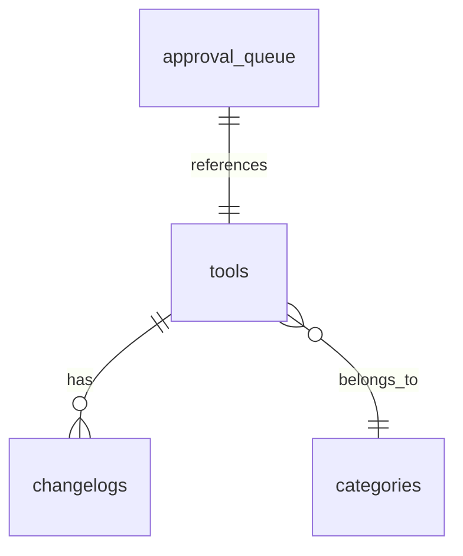

# DOCS_STANDARD.md — Avelix Documentation Standard

Every agent must produce documentation alongside its code.
This file defines what to document, how to format it, and where to save it.
Read this file before writing any documentation.

---

## The Rule

No agent is done until its documentation is written.
Code without docs is incomplete work.
The documentation must be written BY the agent AS it builds — not after.

---

## Documentation Folder Structure

```
avelix/
└── docs/
    ├── 00-visual-identity.md
    ├── 01-scaffold.md
    ├── 02-database.md
    ├── 03-tools-library.md
    ├── 04-models-library.md
    ├── 05-skills-library.md
    ├── 06-glossary.md
    ├── 07-homepage.md
    ├── 08-search-filters.md
    ├── 09-admin-panel.md
    ├── 10-seo.md
    ├── 11-sync-pipeline.md
    ├── 12-seeding.md
    ├── 13-deployment.md
    ├── components/
    │   ├── ToolCard.md
    │   ├── ModelCard.md
    │   ├── SkillCard.md
    │   ├── FilterSidebar.md
    │   ├── GlobalSearch.md
    │   ├── Header.md
    │   ├── Footer.md
    │   └── [ComponentName].md
    ├── api/
    │   ├── webhooks.md
    │   ├── admin-routes.md
    │   └── og-images.md
    ├── database/
    │   ├── schema.md
    │   ├── rls-policies.md
    │   └── queries.md
    └── decisions/
        ├── ADR-001-tech-stack.md
        ├── ADR-002-search-provider.md
        └── ADR-[N]-[topic].md
```

---

## What Every Agent Must Document

### 1. Agent Summary Doc — `docs/[NN]-[agent-name].md`

Template:
```markdown
# [Agent Name] — Documentation

## What Was Built
Brief summary of everything this agent produced.

## Files Created
List every file created or modified with its path and one-line purpose.
| File | Purpose |
|---|---|
| app/tools/page.tsx | Tools library listing page |
| components/library/ToolCard.tsx | Reusable tool card component |

## Key Decisions
Document any architectural or design decision made during this agent.
Why was X chosen over Y? What tradeoffs were made?

## How It Works
Plain-language explanation of the main logic.
No jargon. Written for a developer joining the project on day 1.

## Environment Variables Used
List any env vars this agent's code depends on.

## Dependencies Added
Any new npm packages installed, with version and reason.

## Known Limitations
Anything intentionally left incomplete, deferred, or simplified.

## How to Test
Step-by-step instructions to verify this agent's work is functioning.

## Related Agents
Which agents must run before this one, and which agents depend on it.
```

---

### 2. Component Docs — `docs/components/[ComponentName].md`

Every custom component gets its own doc. Template:
```markdown
# [ComponentName]

## Purpose
What this component does and why it exists.

## Location
`components/[path]/ComponentName.tsx`

## Props
| Prop | Type | Required | Default | Description |
|---|---|---|---|---|
| title | string | yes | — | Card title |
| slug | string | yes | — | URL slug |

## Variants
List all visual variants (default, compact, featured, etc.)
Include a description of when to use each.

## Usage Example
\`\`\`tsx
<ToolCard
  title="ElevenLabs"
  slug="elevenlabs"
  category="AI Voice Tools"
  variant="default"
/>
\`\`\`

## Design Notes
Which DESIGN.md patterns this component implements.
Any deviations from the design system and why.

## States
Loading, empty, error, hover, active — describe each.

## Accessibility
Any aria labels, keyboard navigation, or screen reader notes.
```

---

### 3. Database Docs — `docs/database/schema.md`

Agent 02 must produce:
- Full schema with table descriptions
- Every column: name, type, nullable, default, purpose
- All indexes and why they exist
- All RLS policies in plain English
- ER diagram in Mermaid format

---

### 4. API Route Docs — `docs/api/`

Every API route (`app/api/*/route.ts`) gets documented:
```markdown
# POST /api/webhooks/sync

## Purpose
Receives new items from n8n sync pipeline and adds to approval queue.

## Authentication
Requires `N8N_WEBHOOK_SECRET` header. Returns 401 if missing or invalid.

## Request Body
| Field | Type | Required | Description |
|---|---|---|---|
| content_type | string | yes | 'tool' or 'model' or 'skill' |
| title | string | yes | Item title |

## Response
200 OK — item queued successfully
401 Unauthorized — invalid secret
422 Unprocessable — validation failed

## Example
\`\`\`bash
curl -X POST https://avelix.ai/api/webhooks/sync \
  -H "x-webhook-secret: YOUR_SECRET" \
  -H "Content-Type: application/json" \
  -d '{"content_type": "tool", "title": "ElevenLabs"}'
\`\`\`
```

---

### 5. Architecture Decision Records — `docs/decisions/ADR-[N]-[topic].md`

Any significant decision that affects the whole project gets an ADR:
```markdown
# ADR-001: Use Algolia for Search

## Status
Accepted

## Context
The site will have 500+ tools, 100+ models, and 200+ skills.
Users need instant, typo-tolerant, faceted search.

## Decision
Use Algolia with a Supabase FTS fallback.

## Consequences
- Algolia free tier: 10,000 searches/month
- Requires sync script after every publish
- Search API key safe for client-side use
- Switch to Supabase FTS if budget is a constraint at scale
```

---

### 6. n8n Workflow Docs — `docs/11-sync-pipeline.md`

Agent 11 must document every workflow:
- What triggers it
- Every node and what it does
- What data flows between nodes
- Error handling at each step
- How to test it manually
- What to check if it breaks

---

### 7. Deployment Docs — `docs/13-deployment.md`

Agent 13 must produce a runbook:
- Every environment variable and where to get its value
- Step-by-step first deployment
- Step-by-step re-deployment after changes
- How to roll back a bad deployment
- How to check if the site is healthy
- Common errors and how to fix them

---

## Documentation Quality Rules

1. Write for a developer who has never seen this project
2. No assumptions — if it requires setup, document the setup
3. Every code example must be runnable as-is
4. Every env var must be explained — what it is, where to find it
5. If you made a tradeoff, document why
6. Update the doc if the code changes
7. Plain English first, technical detail second
8. Tables over paragraphs for structured data
9. Mermaid diagrams for flows and relationships
10. Never write "see the code" — the doc must stand alone

---

## Mermaid Diagram Templates

### Component relationship


### Data flow


### Database schema (ER)


---

## When Documentation Is Written

Not after. During.

- Create the `docs/[NN]-agent-name.md` file at the START of the agent run
- Update it section by section as each piece is built
- Write component docs immediately after each component is created
- Write API docs immediately after each route is created
- Write the ADR when a significant decision is made
- Final check: does the doc cover everything someone needs to use this without asking questions?

