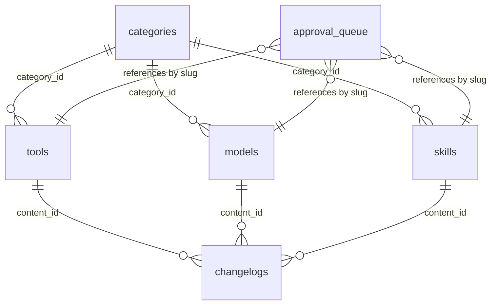

# Agent 02 — Database Schema

## What Was Built

Complete PostgreSQL schema on Supabase, TypeScript types, typed Supabase clients, and seed data.

---

## Files Created

| File | Purpose |
|---|---|
| `supabase/migrations/20260515000000_initial_schema.sql` | Full schema DDL — enums, tables, indexes, RLS, triggers |
| `supabase/seed.sql` | Reference seed SQL (categories, use_cases, tags) |
| `scripts/seed.mjs` | Node script that ran seed data against live Supabase |
| `types/database.ts` | Hand-written TypeScript types matching the Supabase schema |
| `lib/supabase.ts` | Browser client — typed with `Database` |
| `lib/supabase-server.ts` | SSR server client + static client (no cookies) |
| `lib/supabase-admin.ts` | Service role client — bypasses RLS, for admin/seeding |

---

## Tables Created

| Table | Purpose |
|---|---|
| `categories` | Taxonomy for tools, models, and skills |
| `tags` | Flat tag system |
| `use_cases` | Reusable use case tags |
| `sources` | Trusted external sources with trust score |
| `tools` | AI tool entries |
| `models` | AI model entries |
| `skills` | AI skill/learning entries |
| `learning_paths` | Guided learning sequences |
| `comparisons` | Tool/model comparison pages |
| `glossary_terms` | AI terminology glossary |
| `prompts` | Prompt template library |
| `workflows` | Step-by-step AI workflows |
| `articles` | Blog articles |
| `services` | Avelix service offerings |
| `social_posts` | Social content mapped to pages |
| `approval_queue` | Pending human review items |
| `changelogs` | Per-item change history |

---

## Enums

| Enum | Values |
|---|---|
| `status_enum` | `draft`, `review`, `approved`, `published`, `archived` |
| `difficulty_enum` | `beginner`, `intermediate`, `advanced` |
| `pricing_enum` | `free`, `freemium`, `paid`, `open-source`, `enterprise` |
| `content_type_enum` | `tool`, `model`, `skill`, `guide`, `glossary`, `comparison`, `article`, `workflow`, `prompt` |

---

## RLS Policies

All content tables have RLS enabled. Public users (anon key) can only SELECT rows where `status = 'published'`. The `approval_queue` has no public policy — only the service role can access it.

The service role key (in `SUPABASE_SERVICE_ROLE_KEY`) bypasses all RLS — use `createAdminSupabaseClient()` for admin operations.

---

## Client Usage

```typescript
// In Server Components (request context) — has auth cookie support
import { createServerSupabaseClient } from '@/lib/supabase-server'
const supabase = createServerSupabaseClient()

// In generateStaticParams / build-time — no request context, no cookies
import { createStaticSupabaseClient } from '@/lib/supabase-server'
const supabase = createStaticSupabaseClient()

// In admin routes / seeding scripts — bypasses RLS
import { createAdminSupabaseClient } from '@/lib/supabase-admin'
const supabase = createAdminSupabaseClient()

// In Client Components
import { createClient } from '@/lib/supabase'
const supabase = createClient()
```

---

## Indexes

- `tools`: slug, status, category_id, tags (GIN), full-text search (GIN tsvector)
- `models`: slug, status, provider, model_type, full-text search
- `skills`: slug, status, difficulty
- `glossary_terms`: slug, status
- `comparisons`: slug, status
- `approval_queue`: status, content_type
- `changelogs`: (content_type, content_slug)

---

## Seed Data Applied

- 22 categories (10 tool, 6 model, 6 skill)
- 13 use cases
- 15 tags

---

## Key Decisions

**`createStaticSupabaseClient` vs `createServerSupabaseClient`:** Next.js `generateStaticParams` runs at build time without a request scope, so `cookies()` throws. A plain `@supabase/supabase-js` client (no SSR wrapper) is used for these build-time reads.

**Types hand-written:** The `supabase gen types` CLI requires Docker for local schema introspection. Since Docker is not available, types were written manually — they exactly mirror the migration SQL and will be regenerated when Docker is available via `npx supabase gen types typescript --project-id hgloedsnmpntnohvxhie`.

---

## How to Test

1. `npm run build` — confirms static generation works
2. Check Supabase dashboard → Table Editor — 17 tables should be visible
3. Check categories table — 22 rows should be present

---

## Related Agents

- Depends on: Agent 01 (scaffold)
- Enables: Agents 03–13 (all use the database)

---

## ER Diagram (core tables)


