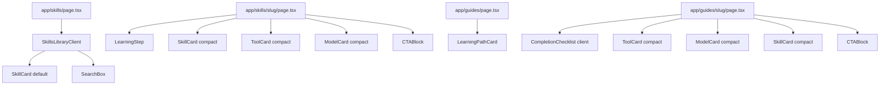

# Agent 05 — Skills Library

## What Was Built

The complete AI Skills Library and Learning Paths sections of Avelix:
- `/skills` — filterable skills index with search
- `/skills/[slug]` — individual skill pages with step-by-step learning guides
- `/guides` — learning paths index with audience-first navigation
- `/guides/[slug]` — individual learning path pages with completion tracking

All pages use real Supabase data in production and fall back to mock data in dev mode (same pattern as Agent 03/04).

---

## Files Created

| File | Purpose |
|---|---|
| `types/skill.ts` | Skill, LearningPath, LearningStep, LearningModule types + filter interfaces |
| `lib/mock-skills.ts` | 3 mock skills for dev/no-Supabase mode |
| `lib/mock-learning-paths.ts` | 2 mock learning paths for dev mode |
| `lib/queries/skills.ts` | Supabase queries: getSkills, getSkillBySlug, getRelatedSkills, getSkillsByCategory |
| `lib/queries/learning-paths.ts` | Supabase queries: getLearningPaths, getLearningPathBySlug, getPublishedPathSlugs |
| `components/library/SkillCard.tsx` | Skill card — 3 variants: default, compact, featured |
| `components/library/LearningPathCard.tsx` | Learning path card for the guides index |
| `components/shared/LearningStep.tsx` | Numbered step card for skill learning guides |
| `components/shared/PromptBlock.tsx` | Copyable prompt block with optional title/model label |
| `components/pages/SkillsLibraryClient.tsx` | Client component — search + filter bar for /skills |
| `components/pages/CompletionChecklist.tsx` | Client component — interactive checklist with localStorage persistence |
| `app/skills/page.tsx` | Skills library index (Server Component) |
| `app/skills/[slug]/page.tsx` | Individual skill page (Server Component) |
| `app/guides/page.tsx` | Learning paths index (Server Component) |
| `app/guides/[slug]/page.tsx` | Individual learning path page (Server Component) |
| `docs/05-skills-library.md` | This file |

---

## Key Decisions

### No separate SkillsLibraryClient sidebar pattern
Skills filtering is simpler than tools — only difficulty, time, and sort. Used a horizontal filter bar (not a sidebar) to match the content type. Sidebar would be overkill for 3 filter dimensions.

### CompletionChecklist as isolated Client Component
Only the checklist needs client-side interactivity (localStorage). The rest of the guide page is a Server Component. This keeps the RSC/client split clean.

### Mock data fallback
Same `USE_MOCK = !process.env.NEXT_PUBLIC_SUPABASE_URL` pattern used in Agent 03/04. Dev mode works without Supabase configured.

### LearningStep progress bar as visual affordance
Each step shows a progress bar at its bottom, filled proportionally to the step number. Visual, not interactive — the step number provides orientation without adding client state.

---

## How It Works

### `/skills` page
1. `app/skills/page.tsx` (Server) reads `searchParams` → parses into `SkillFilters`
2. Calls `getSkills(filters)` which queries Supabase with `.eq('status', 'published')` + active filters
3. Passes results to `SkillsLibraryClient` (Client) which handles filter interactions via router push

### `/skills/[slug]` page
1. `generateStaticParams()` fetches all published skill slugs at build time
2. `generateMetadata()` generates SEO title/description from skill data
3. Page fetches skill, required tools, related tools, related models, related skills in parallel via `Promise.all`
4. Renders all sections as Server Components (no client JS except CopyButton within PromptBlock)

### `/guides` page
- Static page: no filters needed on this view
- Hardcoded audience-first nav (5 entries matching the 5 seeded learning paths)
- Fetches all learning paths from Supabase for the "All Paths" grid

### `/guides/[slug]` page
- Same SSG pattern as skills: `generateStaticParams` + `generateMetadata`
- `CompletionChecklist` is a 'use client' island — uses `localStorage` to persist checked state per path slug (key: `avelix-checklist-${pathSlug}`)
- Module list and practice tasks are server-rendered

---

## Environment Variables Used

| Variable | Purpose |
|---|---|
| `NEXT_PUBLIC_SUPABASE_URL` | Enables real data (falsy → mock mode) |
| `NEXT_PUBLIC_SUPABASE_ANON_KEY` | Public read access for static client |

---

## Dependencies Added

None — no new npm packages. Reuses `@supabase/supabase-js`, `next`, and the existing component patterns from Agent 03/04.

---

## Known Limitations

- **Category grouping** not yet implemented on `/skills` index. The spec mentions category-first browsing with a toggle. Deferred — current flat list with difficulty filter covers the MVP need. Category grouping requires categories to be joined (the `category_id` is a UUID, not a name).
- **Recommended Prompts** section in skill pages is omitted — `recommended_prompt_slugs` field exists but the `prompts` table query is not yet built (Agent 07 scope).
- **Related Articles & Videos** section omitted — requires articles table (Agent 07 scope).
- **SkillCard featured variant** exists in the component but is not yet used — reserved for homepage featured skills section.

---

## How to Test

1. Start dev server: `npm run dev`
2. Visit `/skills` — should show skill cards with difficulty/time filter bar
3. Click difficulty filter — list should update (URL updates, page re-renders with new filter)
4. Visit `/skills/prompt-engineering-basics` — should show all sections: overview, required tools, learning steps, practical examples, common mistakes
5. Visit `/guides` — should show audience-first nav + all learning paths grid
6. Visit `/guides/start-learning-ai-from-zero` — should show modules, practice tasks, recommended tools, completion checklist
7. Check an item in the completion checklist, refresh the page — item should remain checked (localStorage persistence)

---

## Component Diagrams

---

## Related Agents

| Agent | Relation |
|---|---|
| Agent 02 | Database schema — skills and learning_paths tables |
| Agent 03 | Tools Library — ToolCard and query patterns reused |
| Agent 04 | Models Library — ModelCard and query patterns reused |
| Agent 12 | Data Seeding — 15 skills and 5 learning paths seeded |
| Agent 07 | Guides / Articles — extends this with article cards and prompt blocks |
