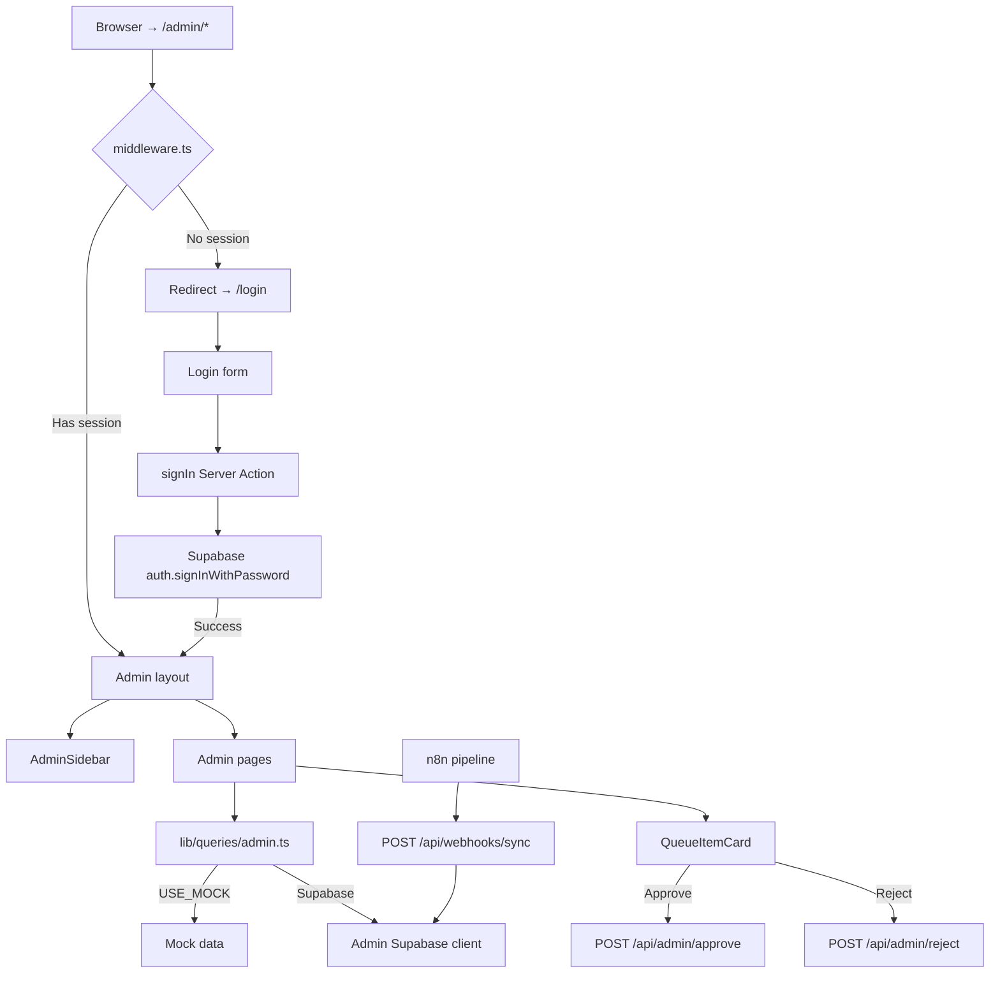

# Agent 09 — Admin Panel & Approval Workflow

## What Was Built

A fully-protected admin panel for reviewing and approving AI-generated content drafts, managing tools/models/skills data tables, monitoring sync sources, and configuring system settings. Includes Supabase Auth middleware, a terminal-style login page, and a webhook endpoint for the n8n sync pipeline.

---

## Files Created / Modified

| File | Purpose |
|---|---|
| `middleware.ts` | Protect all `/admin/*` routes — redirects to `/login` if not authenticated |
| `app/login/page.tsx` | Terminal-style email/password login form |
| `app/login/actions.ts` | Server Actions for `signIn` and `signOut` |
| `app/admin/layout.tsx` | Admin shell layout with sidebar and top bar |
| `app/admin/page.tsx` | Dashboard with stats grid and activity feed |
| `app/admin/queue/page.tsx` | Approval queue with status tabs and bulk actions |
| `app/admin/tools/page.tsx` | Tools management data table |
| `app/admin/models/page.tsx` | Models management data table |
| `app/admin/skills/page.tsx` | Skills management data table |
| `app/admin/sources/page.tsx` | Source registry management |
| `app/admin/settings/page.tsx` | Sync, content rules, and Algolia settings |
| `components/admin/AdminSidebar.tsx` | Fixed sidebar with nav links and logout |
| `components/admin/StatCard.tsx` | Dashboard stat card (value, label, icon, accent) |
| `components/admin/ActivityFeed.tsx` | Changelog activity timeline |
| `components/admin/QueueItemCard.tsx` | Approval queue item with approve/reject actions |
| `components/admin/DataTable.tsx` | Generic sortable/filterable table component |
| `lib/queries/admin.ts` | Admin queries with mock fallback + all admin data functions |
| `app/api/admin/approve/route.ts` | POST — approve a queue item |
| `app/api/admin/reject/route.ts` | POST — reject a queue item with reason |
| `app/api/admin/sync/trigger/route.ts` | POST — trigger n8n sync webhook |
| `app/api/webhooks/sync/route.ts` | POST — receive new items from n8n pipeline |

---

## Key Decisions

### Mock mode passes through middleware without auth
`USE_MOCK = !process.env.NEXT_PUBLIC_SUPABASE_URL`. When Supabase is not configured, the middleware lets all `/admin/*` requests through, allowing local development without a live auth session. When Supabase IS configured (production), the middleware validates the session and redirects to `/login` if absent.

### No TanStack Table — native React DataTable
TanStack Table was not in the project's dependencies. `DataTable.tsx` implements sortable columns, status filter tabs, and search filtering natively with `useMemo` — fewer dependencies, same result for the admin use case.

### QueueItemCard uses client-side fetch (not Server Actions)
The approve/reject actions call `/api/admin/approve` and `/api/admin/reject` via `fetch()` from the client. This allows `useTransition` + `router.refresh()` to update the queue without a full page reload, while keeping the optimistic local state update.

### Admin layout is independent of public layout
The admin shell (`app/admin/layout.tsx`) does not use the public `Header` or `Footer` components. It renders its own fixed sidebar + top bar. This keeps public and admin layouts cleanly separated.

### Sources use mock data only (no `sources` table in DB)
The `sources` table is not yet in the database schema. `getSources()` returns `MOCK_SOURCES` from `lib/queries/admin.ts`. A future agent can add the Supabase table and wire it in.

---

## Architecture



---

## Environment Variables Used

| Variable | Required | Used For |
|---|---|---|
| `NEXT_PUBLIC_SUPABASE_URL` | For production auth | Enables auth middleware + Supabase queries |
| `NEXT_PUBLIC_SUPABASE_ANON_KEY` | For production auth | Middleware session check |
| `SUPABASE_SERVICE_ROLE_KEY` | For admin DB access | `createAdminSupabaseClient()` — bypasses RLS |
| `N8N_WEBHOOK_SECRET` | For webhook security | Validates `x-webhook-secret` header on `/api/webhooks/sync` |
| `N8N_WEBHOOK_URL` | For triggering sync | Used by `/api/admin/sync/trigger` to call n8n |

---

## API Routes

### POST `/api/admin/approve`
Approves a queue item and publishes the associated content.
```json
Body: { "queue_id": "q1", "content_type": "tool", "content_id": "tool-id" }
Response 200: { "success": true }
```

### POST `/api/admin/reject`
Rejects a queue item with a reason.
```json
Body: { "queue_id": "q1", "reason": "No verified source found" }
Response 200: { "success": true }
```

### POST `/api/admin/sync/trigger`
Triggers the n8n sync webhook manually. Requires `N8N_WEBHOOK_URL` env var.
```json
Response 200: { "success": true, "message": "Sync triggered successfully" }
Response 503: { "error": "N8N_WEBHOOK_URL not configured" }
```

### POST `/api/webhooks/sync`
Receives new items from the n8n pipeline. Validates `x-webhook-secret` header.
```json
Body: {
  "content_type": "tool",
  "title": "ElevenLabs",
  "slug": "elevenlabs",
  "short_description": "AI voice synthesis platform.",
  "source_url": "https://blog.elevenlabs.io/...",
  "ai_confidence": 89,
  "summary_of_changes": "New Creator Plan at $22/month.",
  "action": "update"
}
Response 200: { "success": true, "content_id": "uuid", "message": "Item queued for review" }
Response 401: { "error": "Unauthorized" } (wrong or missing secret)
Response 422: { "error": "Missing required fields: content_type, title, slug" }
```

---

## How to Test

### Mock mode (no Supabase)
1. `npm run dev` — with no `NEXT_PUBLIC_SUPABASE_URL` in `.env.local`
2. Visit `http://localhost:3000/admin` — loads directly without auth
3. Click "Review Queue" → see mock approval items
4. Click "Approve" on a pending item → status changes to Approved

### Production mode (with Supabase)
1. Ensure `.env.local` has all Supabase vars
2. `npm run dev`
3. Visit `http://localhost:3000/admin` → redirects to `/login`
4. Login with your Supabase admin credentials
5. Explore all admin pages

### Webhook test
```bash
curl -X POST http://localhost:3000/api/webhooks/sync \
  -H "Content-Type: application/json" \
  -H "x-webhook-secret: YOUR_SECRET" \
  -d '{
    "content_type": "tool",
    "title": "NewTool",
    "slug": "new-tool",
    "short_description": "A new AI tool.",
    "ai_confidence": 85,
    "action": "create"
  }'
```

---

## Known Limitations

- Sources table (`sources`) does not yet exist in Supabase — always returns mock data
- Bulk approve (all high-confidence) button is wired to UI but not yet connected to the API
- Tool/model/skill edit forms show "Add" button placeholder — full edit form is a future task
- Settings page saves to UI state only — no Supabase settings table exists yet
- Admin role check is session-based only (any authenticated user can access admin). Add JWT custom claims for role-based restriction in production
- `/admin/sources`, `/admin/settings` use mock/static data only

---

## Related Agents

- **Agent 02** — Database schema (approval_queue, changelogs tables)
- **Agent 13** — Sync pipeline (n8n workflows that POST to `/api/webhooks/sync`)
