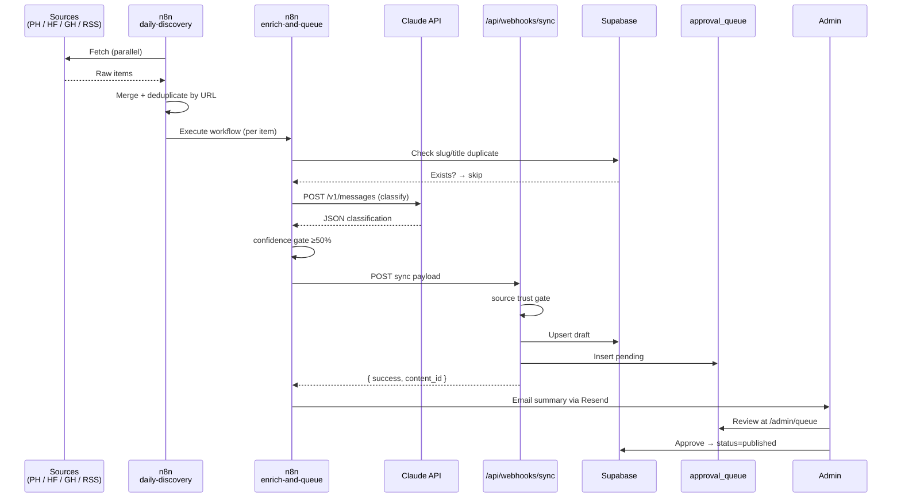

# Agent 11 — Sync Pipeline (n8n)

## What Was Built

A complete, multi-stage automation pipeline that discovers new AI tools and models daily, enriches them with Claude, and queues them for human review. **Nothing is ever auto-published.**

---

## Files Created / Modified

| File | Purpose |
|---|---|
| `n8n/workflows/daily-discovery.json` | n8n workflow — fetch from Product Hunt, HuggingFace, GitHub, RSS feeds; merge and deduplicate; hand off to enrichment |
| `n8n/workflows/enrich-and-queue.json` | n8n workflow — dedup against Supabase, call Claude for classification, apply confidence gate, POST to Avelix webhook |
| `n8n/workflows/update-monitor.json` | n8n workflow — check published tools/models for page changes (14:00 UTC daily) |
| `n8n/workflows/stale-page-detector.json` | n8n workflow — flag content not reviewed in 30+ days (every Sunday) |
| `n8n/README.md` | Setup guide, credential requirements, test commands, debugging tips |
| `app/api/webhooks/sync/route.ts` | Enhanced with confidence gate (< 50% → 422), source trust gate, and effective score calculation |
| `app/api/admin/notify/route.ts` | New endpoint — receives sync summary from n8n, sends HTML email via Resend |

---

## Key Decisions

### 1. Human-in-the-loop, always

Every item the pipeline discovers is stored as `status = 'draft'` and added to `approval_queue` with `status = 'pending'`. There is no path from discovery to `status = 'published'` without a human clicking Approve. This was a non-negotiable requirement from the agent spec.

**Tradeoff:** Lower throughput on launch. Benefit: zero hallucinated or incorrect entries ever going live.

### 2. Two-stage confidence filtering

Filtering happens at two independent layers:
- **n8n layer** (`Confidence Gate` node) — Claude's own estimate < 50% → item discarded before even hitting the webhook
- **Webhook layer** (`app/api/webhooks/sync/route.ts`) — same gate enforced again server-side, cannot be bypassed

If n8n is misconfigured or someone calls the webhook directly with a low-confidence item, the server rejects it. The webhook is the authoritative gate.

### 3. Source trust scoring in the webhook

Each source URL is matched against a domain list with trust scores (0.0–1.0). Domains not on the list get 0.4 — below the 0.5 gate. This prevents the pipeline from ingesting items discovered from random or low-quality blogs.

The effective confidence stored in Supabase is `min(ai_confidence / 100, source_trust)` — so even a 95%-confident Claude response from an untrusted source gets a lower final score.

### 4. n8n calls Claude directly via HTTP

n8n doesn't have a native Anthropic node. Enrichment uses `n8n-nodes-base.httpRequest` calling `https://api.anthropic.com/v1/messages`. This is intentional — avoids dependency on community nodes that may break across n8n versions.

**Haiku vs Opus:** Discovery enrichment uses `claude-opus-4-7` (full classification needed). Update detection uses `claude-haiku-4-5-20251001` (cheaper for the "did anything change?" question, runs on hundreds of pages daily).

### 5. Stale detection uses a 30-day threshold

Items published but not reviewed in 30 days get re-queued with `action = 'update'` and a neutral 75% confidence. This ensures the admin sees them for re-verification without blocking them (they stay published until rejected or re-approved).

---

## How It Works

### Pipeline stages

**Stage 1 — Discovery (06:00 UTC)**

`daily-discovery.json` fires and runs four parallel fetches:
- Product Hunt GraphQL API → posts tagged AI from the past 24 hours
- HuggingFace REST API → 20 newest `text-generation` models
- GitHub Search API → AI/LLM repos created in the past 24 hours with 50+ stars
- n8n RSS Feed node → 6 official AI company blogs in one pass

Each source normalizer produces items with the same schema: `{ title, description, url, source, source_trust, discovered_at }`.

All four streams merge into one array, which is deduplicated by URL before being handed to `enrich-and-queue.json` via `ExecuteWorkflow`.

**Stage 2 — Enrichment (per item)**

`enrich-and-queue.json` processes each raw discovery:
1. **Slugify & normalize** — compute slug and lowercase title for comparison
2. **Supabase dedup** — query `tools`, `models`, and `approval_queue` for matching slug or title; skip if found
3. **Claude classification** — `claude-opus-4-7` returns a JSON object with `content_type`, `confidence_score`, `tags`, `pricing_model`, etc.
4. **Confidence gate** — if Claude's confidence × 100 < 50, the item is logged as rejected and not sent to the webhook
5. **Webhook call** — POST to `/api/webhooks/sync` with full payload including classification data
6. **Summary** — collect all queued and rejected counts, POST to `/api/admin/notify`

**Stage 3 — Notification**

`/api/admin/notify` receives the summary, renders an HTML email showing every queued item's title, type, and confidence score, and sends it via Resend to `ADMIN_EMAIL`.

**Stage 4 — Update monitoring (14:00 UTC)**

`update-monitor.json` fetches all published tools and models from Supabase, downloads each primary source URL, computes a content fingerprint, and asks Claude Haiku whether the page likely contains new information. If Claude detects a change with ≥60% confidence, the item is re-queued as an `update` action.

**Stage 5 — Stale detection (Sunday 08:00 UTC)**

`stale-page-detector.json` queries all three content tables for items with `last_reviewed_at` older than 30 days (or NULL). Each stale item is re-queued with a message telling the admin how many days have passed since last review.

### Webhook validation flow

```
POST /api/webhooks/sync
  → check x-webhook-secret header
  → parse JSON body
  → validate required fields (content_type, title, slug)
  → confidence gate: ai_confidence < 50 → 422
  → source trust gate: domain trust < 0.5 → 422
  → compute effective_score = min(ai_confidence/100, source_trust)
  → upsert into tools/models/skills (status=draft)
  → insert into approval_queue (status=pending)
  → return { success: true, content_id }
```

---

## Environment Variables Used

| Variable | Where Set | Purpose |
|---|---|---|
| `N8N_WEBHOOK_SECRET` | `.env.local` + n8n env | Authenticates n8n ↔ Avelix calls |
| `N8N_WEBHOOK_URL` | `.env.local` | Manual sync trigger target (n8n webhook URL) |
| `RESEND_API_KEY` | `.env.local` | Send admin notification emails |
| `ADMIN_EMAIL` | `.env.local` | Recipient for notification emails |
| `NEXT_PUBLIC_SUPABASE_URL` | `.env.local` | If absent, webhook runs in mock mode |
| `SUPABASE_SERVICE_ROLE_KEY` | `.env.local` | Write access to draft tables |
| `SKIP_SOURCE_TRUST_CHECK` | `.env.local` | Set to any value to bypass source gate in dev |
| `ANTHROPIC_API_KEY` | n8n env | Claude API calls from n8n |
| `AVELIX_BASE_URL` | n8n env | Base URL for webhook calls |
| `ENRICH_WORKFLOW_ID` | n8n env | Links daily-discovery → enrich-and-queue |

---

## Dependencies Added

None — no new npm packages. Resend is called via `fetch` (no SDK needed). n8n runs as a separate service.

---

## Known Limitations

1. **Content fingerprinting is naive** — the update monitor computes a length + character-sum fingerprint, not a real hash. It will miss changes to content that stays the same length. A proper implementation would store a SHA-256 of the page body in Supabase.

2. **No rate limiting on webhook** — the `/api/webhooks/sync` endpoint has no rate limiting. A malicious caller with the secret could flood the approval queue. Add `next-rate-limit` or Upstash rate limiting before production launch.

3. **Product Hunt rate limits** — the discovery workflow makes one GraphQL call per run. If Product Hunt throttles the token, the node will fail silently (n8n continues to the next source). Add error handling in the normalize node.

4. **n8n workflow IDs are runtime-assigned** — the `ENRICH_WORKFLOW_ID` must be set manually after importing the workflows. It cannot be pre-filled in the JSON.

5. **RSS deduplication** — the merge step deduplicates by URL. If an RSS item appears in two feeds with different URLs (e.g., canonical and AMP), it will be processed twice.

---

## How to Test

### 1. Test webhook confidence gate

```bash
# Expect 422: low confidence
curl -X POST http://localhost:3000/api/webhooks/sync \
  -H "x-webhook-secret: test-secret" \
  -H "Content-Type: application/json" \
  -d '{"content_type":"tool","title":"Test","slug":"test","short_description":"x","ai_confidence":30}'

# Expect 200: high confidence + trusted source
curl -X POST http://localhost:3000/api/webhooks/sync \
  -H "x-webhook-secret: test-secret" \
  -H "Content-Type: application/json" \
  -d '{"content_type":"tool","title":"GPT Store","slug":"gpt-store","short_description":"OpenAI GPT store","source_url":"https://openai.com/blog/gpt-store","ai_confidence":85}'
```

### 2. Test notification endpoint (dev)

```bash
curl -X POST http://localhost:3000/api/admin/notify \
  -H "x-webhook-secret: test-secret" \
  -H "Content-Type: application/json" \
  -d '{"queued":[{"title":"Test Tool","content_type":"tool","slug":"test-tool","ai_confidence":85,"action":"create"}],"rejected_count":1,"run_at":"2026-05-16T06:00:00Z"}'
```

### 3. Test n8n workflows in n8n UI

1. Import all four JSON files
2. Open `enrich-and-queue` → click **Execute Workflow manually** with sample input:
   ```json
   { "title": "Claude 4 Opus", "description": "New Claude model", "url": "https://anthropic.com/blog", "source": "official_blog", "source_trust": 1.0 }
   ```
3. Verify the item appears in `/admin/queue` after execution

### 4. Test manual sync trigger from admin dashboard

1. Open `/admin` in browser
2. Click **Trigger Manual Sync** button
3. Verify n8n webhook fires (check n8n execution history)

---

## Related Agents

- **Requires Agent 09 (Admin Panel)** — approval queue UI and webhook endpoints must exist
- **Requires Agent 02 (Database)** — `approval_queue`, `tools`, `models`, `skills` tables must exist
- **Feeds into Agent 12 (Data Seeding)** — seed scripts populate the same tables this pipeline writes to

---

## Workflow Diagram


